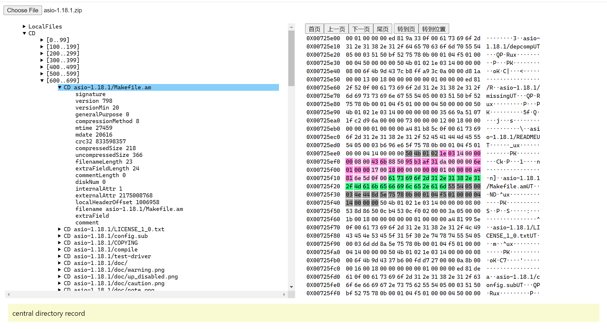

# BDP (binary data parser)

BDP aims to

- build a general purpose binary data parser framework to provide common facilities to parse/present binary data and to have a ability to easily add parser for particular data format.
- build a UI to properly display binary data by a tree structure.
- provide enough pre-defined binary format parser to make it useful out-of-box.

## Background

The background of this project was the attempt to invent a "binary data description language"  that can describe all possible binary format. (similar to [BDDL](http://www.binaryparser.com/sdk/doc/bddl.shtml)).

After some investigation I found that it's hard to define such a language elegantly. For example, the "zip" format request the parser to lookup some special byte pattern to locate the so-called 'EOCD' record, this is really messy. To achieve this we need to introduce a special syntax to the language. After knowing some more similar cases, I realized that it's impossible to keep the language both "elegant" and "powerful enough".

So I went to the way that use javascript language to express the data format in the form of a writting a parser function. Common utilities and frameworks can be well constructed so that for common data format the parser function is still concise, while rare complex logic can also be quickly handled by special ad-hoc code.

below are the comparison between a possible "binary data description language" instance and the javascript parser for ICO file.

language:

```
@exts ico
@byteorder LE

struct IconDirectory {
    uint8 width;
    uint8 height;
    uint8 paletteNumber;
    uint8 reserved;
    uint16 planes;
    uint16 bits;
    uint32 size;
    uint32 offset;
}

byte[] signature = "00 00 01 00"; // ICO file signature (00 00 01 00)
uint16 imageSize; // number of images the ico contains
IconDirectory[imageSize] iconDirectories;
for d in iconDirectories {
    -> d.offset byte[d.size] iconData;
}
```

javascript parser:

```typescript

export class IcoParser implements parser.Parser {
    isSupportedFile(filename: string, ext: string) {
        return ext === 'ico'
    }

    parse(buffer: ArrayBuffer) : dom.Region[] {
        let p = new parser.ParseHelper(buffer)
        p.setEndian(dom.Endian.LE)
    
        const signature = p.createRegion('G', 0, 4, 'signature', 'ICO file signature (00 00 01 00)', p.CV([0, 0, 1, 0]))
        const imageSize = p.createRegion('N', 4, 2, 'imageSize', 'number of images the ico contains')
        const iconDirectories = p.createRegion('C', 6, 16 * p.num.imageSize, 'iconDirectories')
        iconDirectories.subRegions = []
        const images = p.createRegion('C', 0, 0, 'images')
        images.subRegions = []
        for (let i = 0; i < p.num.imageSize; i++) {
            const pos = 6 + 16 * i
            const dir = p.createRegion('C', pos, 16, 'iconDirectory')
            const whInterpreter = function (r: dom.Region) { if (r.numValue === 0n) r.numValue = 256n }
            dir.subRegions = [
                p.createRegion('N', pos, 1, 'width',         'image width in pixels', whInterpreter),
                p.createRegion('N', -1,  1, 'height',        'image height in pixels', whInterpreter),
                p.createRegion('N', -1,  1, 'paletteNumber', 'number of colors in the color palette'),
                p.createRegion('N', -1,  1, 'reserved',      'should be 0'),
                p.createRegion('N', -1,  2, 'planes',        'color planes'),
                p.createRegion('N', -1,  2, 'bits',          'bits per pixel'),
                p.createRegion('N', -1,  4, 'size',          'image size in bytes'),
                p.createRegion('N', -1,  4, 'offset',        'offset of the image data')
            ]

            dir.description =  `${p.num['width']}x${p.num['height']} ${p.num['bits']} bits`
            iconDirectories.subRegions.push(dir)
            images.subRegions.push(p.createRegion('G', p.num.offset, p.num.size, 'images'))
        }
        
        return [
            signature,
            imageSize,
            iconDirectories,
            images
        ]
    }
}
```

## Features

- Pure HTML and client javascript which can be host on any modern web page
- Has the viewer to present tree view and hex view
- Coloring on different field types (support color dimming to distinguish successive range with same type)
- On-demand UI: only the top level tree structure is constructed, deeper level of tree nodes are constructed when user click parent node
- Grouping (default to 100 elements in each group) list items if the list is huge (see screenshot for an example)
- On-demand parsing: the parser can delay any parsing to the time when the user really want to see the data (via on-demand UI)

## Screenshots

### Viewer UI


